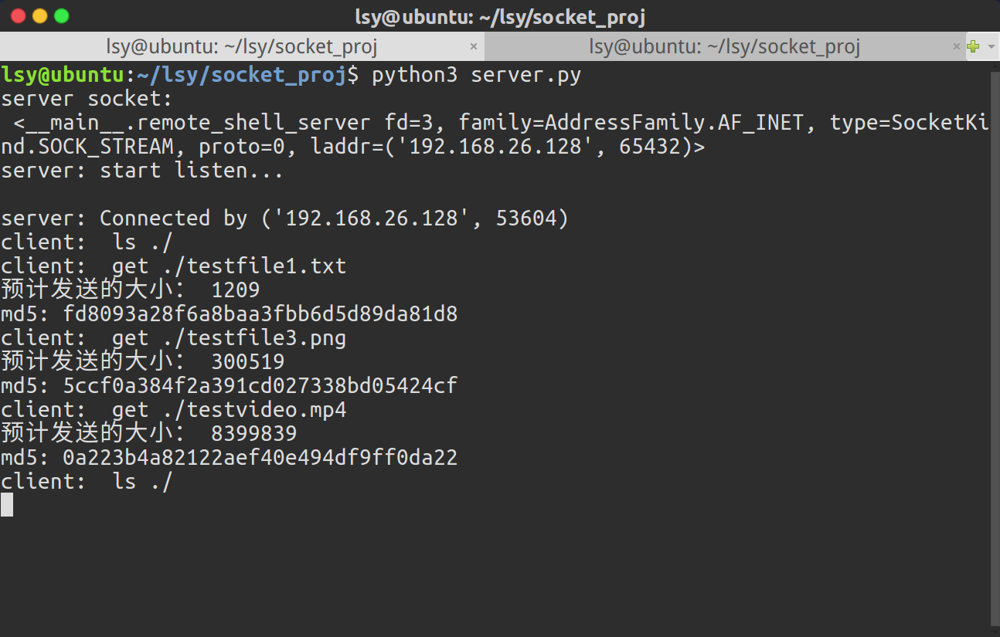
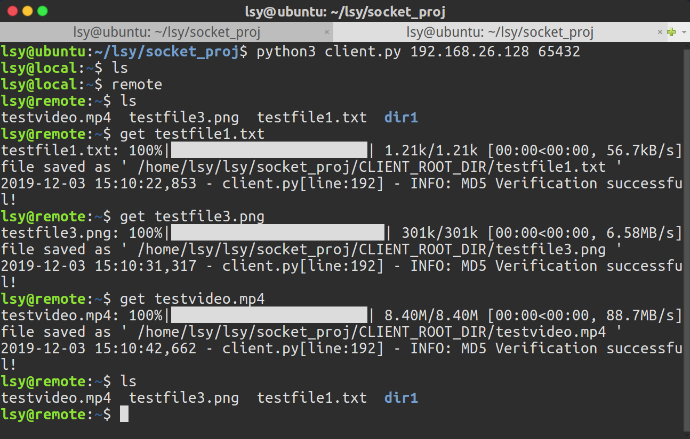

# socket文件传输
本项目是《计算机网络》课程项目，要求用socket实现一个简单的文件服务器，在不同机器之间进行文件的上传和下载。
本人使用python3在ubuntu16.04上进行开发，并尽量保证在windows平台上的兼容性。


# 预期功能
服务器端运行*server.py*，持续监听客户端的连接请求。客户端首先需要知道服务器端的IP地址，这可以通过命令行参数传入，或者在程序文件中指定。开发期间服务器IP指定为127.0.0.1，即localhost默认IP地址。客户端运行*client.py*，请求与服务器连接。连接成功后，客户端打印命令提示符，等待用户输入命令。可选命令包括：
1. 列出客户端或服务器端当前路径下文件（夹）名 --- ls
2. 切换客户端或服务器端当前路径 --- cd
3. 切换ls、cd指令作用的机器 --- local/remote
4. 从服务器端下载文件到客户端当前路径 --- get
5. 递归地将服务器端文件夹下载到客户端当前路径 --- getdir
6. 将客户端文件上传到服务器端当前路径 --- put
7. 递归地将客户端文件夹上传到服务器端当前路径 --- putdir

# 程序说明
在client.py文件所在路径下由客户端维护一个文件夹CLIENT_ROOT_DIR作为客户端根目录，客户端只允许上传该文件夹内的内容，从服务器下载的文件也只允许存放到该文件夹内。
同样，在server.py文件所在路径下由服务器端维护一个文件夹SERVER_ROOT_DIR作为服务器端根目录，客户端只允许请求下载该文件夹内的内容，由客户端上传的文件也只允许存放在该目录内。
如果这两个文件夹不存在，会在客户端或服务器端程序开始运行时自动创建。  
客户端类中还维护两个成员变量，current_local_path和current_remote_path作为当前路径，在进行文件上传和下载时，缺省当前路径名。若需要操作当前路径的子目录内的内容，只许指定子目录名即可。只有cd（change directory）指令可以修改这两个成员变量。  
客户端类中维护一个pos成员变量表示当前位置是客户端还是服务器端，取值为"local"或"remote"。实际上只是影响ls指令和cd指令是作用于current_local_path还是current_remote_path。该变量取值会在命令提示符内显示。  
在进行文件传输时，若目的路径下已有同名文件或文件夹，会在客户端询问用户是覆盖原文件、重命名（添加后缀），还是取消操作。（这一功能还没完全实现）  
在本项目下有一个TEST文件夹，其中包括若干文件和文件夹，用于测试。测试时可以将该文件夹内的内容复制到CLIENT_ROOT_DIR或SERVER_ROOT_DIR。在我本地计算机内还有一个bigfile.txt，文件大小有数百兆，用于测试大文件传输的效果。为了不浪费github空间，我将其添加到了.gitignore列表，在commit和push时将被忽略。

# 依赖库
## tqdm
用于实现进度条效果，在windows的cmd中可能有些bug，在windows的VS code中可以使用PowerShell，整体显示效果堪比Ubuntu下的bash terminal
```bash
# 安装tqdm
python3 -m pip install tqdm
```

# 演示
  
  
更多测试截图可以查看img文件夹

# 参考资料
* [Socket Programming in Python (Guide)](https://realpython.com/python-sockets/)  
* [Python编程：socket实现文件传输](https://blog.csdn.net/mouday/article/details/79101951)  
* [python3 socket文件传输](https://juejin.im/post/5af270fc6fb9a07aa43c3114)  
* [Python 文件I/O](https://www.runoob.com/python/python-files-io.html)  
* [Python os.path() 模块](https://www.runoob.com/python/python-os-path.html)  
* [python中print打印显示颜色](https://blog.csdn.net/qq_34857250/article/details/79673698)  
* [Python3改变cmd（命令行）输出颜色](https://blog.csdn.net/wy_97/article/details/79663014)  
* [Python判断当前操作系统类型以及os/sys/platform模块简介](https://blog.csdn.net/gatieme/article/details/45674367)  
* [python类的继承](https://www.cnblogs.com/bigberg/p/7182741.html)  
* [python 获取脚本所在目录的正确方法](https://blog.csdn.net/vitaminc4/article/details/78702852)  
* [解决CMD命令行窗口不显示颜色问题python](https://blog.csdn.net/qq_15158911/article/details/88943571)  

# 本项目文件树
.  
├── client.py  
├── CLIENT_ROOT_DIR  
├── img  
│   ├── client2.png  
│   ├── client3.png  
│   ├── client.png  
│   ├── server3.png  
│   └── server.png  
├── readme.md  
├── server.py  
├── SERVER_ROOT_DIR  
└── TEST  
    ├── bigfile.txt  
    ├── dir1  
    │   ├── dir1-1  
    │   │   ├── testfile1-1-1.txt  
    │   │   ├── testfile1-1-2.txt  
    │   │   ├── testfile1-1-3.png  
    │   │   └── testfile1-1-4.png  
    │   ├── testfile1-1.txt  
    │   ├── testfile1-2.txt  
    │   ├── testfile1-3.png  
    │   └── testfile1-4.png  
    ├── dir2  
    │   ├── dir2-1  
    │   │   ├── testfile2-1-1.txt  
    │   │   ├── testfile2-1-2.txt  
    │   │   ├── testfile2-1-3.png  
    │   │   └── testfile2-1-4.png  
    │   ├── testfile2-1.txt  
    │   ├── testfile2-2.txt  
    │   ├── testfile2-3.png  
    │   └── testfile2-4.png  
    ├── testfile1.txt  
    ├── testfile2.txt  
    ├── testfile3.png  
    └── testfile4.png  

8 directories, 29 files  
